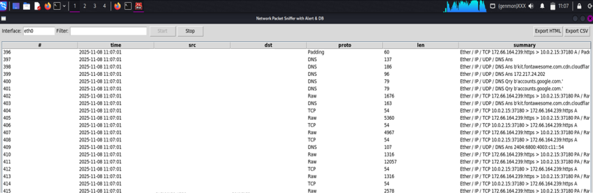
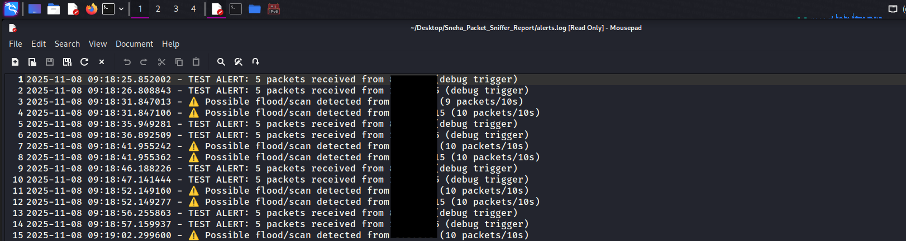
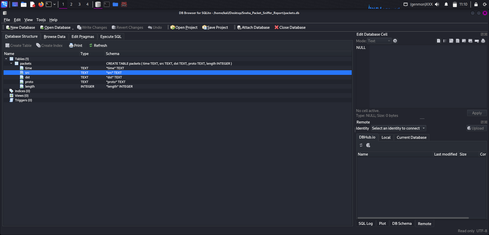

# 🕵️‍♀️ Network Packet Sniffer with Alert System

A **Python-based network packet sniffer** that captures, analyzes, and logs live network traffic using **Scapy**.  
The tool detects potential network anomalies such as **packet floods** or **port scans**, and saves packet data in a local **SQLite database**.  
It includes a **Tkinter GUI** for real-time monitoring, filtering packets, and exporting captured data to **CSV or HTML** formats.

---

## 🚀 Key Features
- 📡 **Live Packet Capturing and Analysis** — monitors real-time network activity using Scapy.  
- 🖥️ **User-Friendly GUI** — built with Tkinter for intuitive control and live updates.  
- ⚠️ **Automatic Anomaly Detection** — identifies potential floods or scans using threshold logic.  
- 🗄️ **Database Logging** — stores all captured packets in an SQLite database for review.  
- 📊 **Report Generation** — exports detailed capture reports in CSV or HTML format.  
- ⚙️ **Lightweight & Customizable** — easy to modify for educational or enterprise use.

---

## 🧠 Tech Stack
**Languages & Libraries:**
- 🐍 Python  
- 📦 Scapy  
- 🪟 Tkinter  
- 🗃️ SQLite3  

---

## 📸 Screenshots

### 🖥️ GUI Interface


### 🌐 Packet Capture


### ⚠️ Alert Detection


### 🧾 Alert Logs


### 🗄️ Database Storage


---

## ⚙️ Installation & Usage

### 🧰 Prerequisites
Make sure you have **Python 3.8+** and **Scapy** installed.

```bash
pip install -r requirements.txt
```
---

### ▶️ Run the Tool

Run as root/admin for live packet capture:

```bash
sudo python3 packet_sniffer_alert_GUI.py
