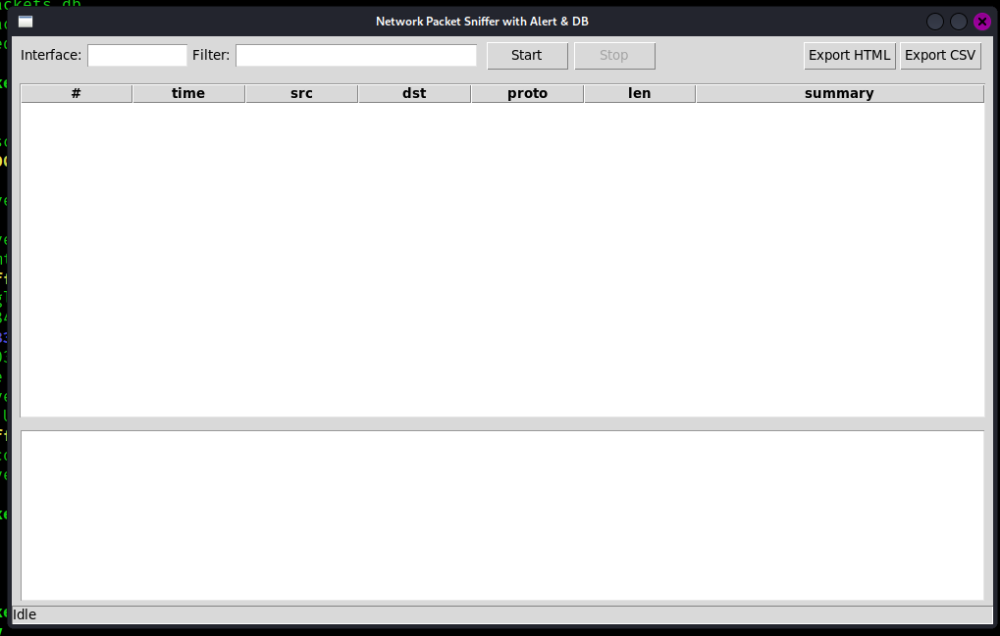
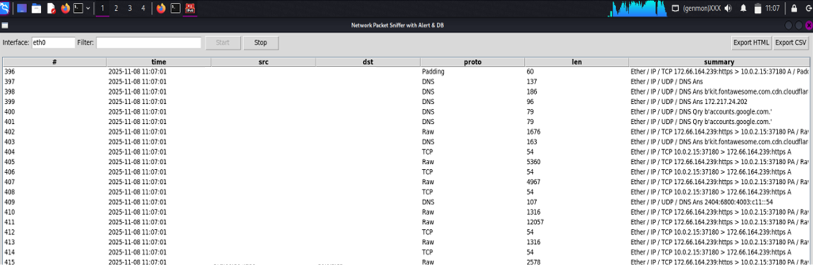
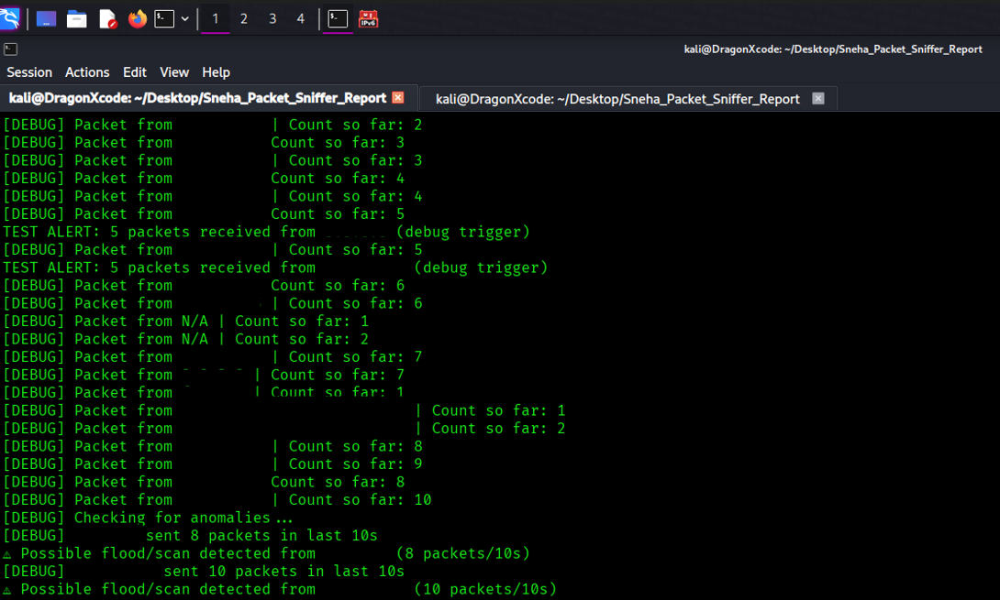
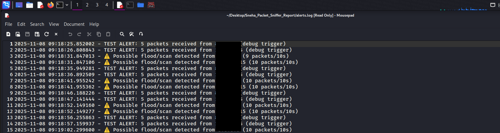
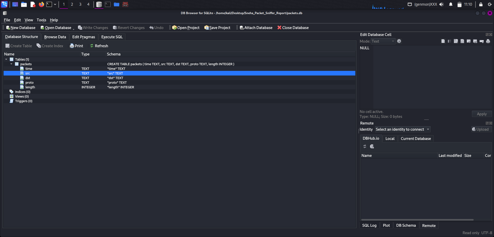

# 🕵️‍♀️ Real-Time Network Traffic Monitoring & Alert System

A Python-based network traffic monitoring and anomaly detection system designed to capture, analyze, and log live network packets in real time.

Built using Scapy, Tkinter, and SQLite, the application monitors network activity, identifies suspicious traffic behaviour such as packet floods or scan attempts, and stores structured logs for further analysis and reporting.

The project combines real-time packet inspection, anomaly detection logic, database logging, and GUI-based monitoring into a lightweight analytical monitoring solution.

---

# 📌 Executive Summary

This project focuses on monitoring and analyzing live network traffic through an interactive packet inspection and alert system built using Python.

The application captures packet-level network activity in real time, processes traffic metadata, detects abnormal communication patterns using threshold-based alert logic, and stores packet logs in a structured SQLite database for historical analysis and reporting.

A Tkinter-based graphical interface enables real-time monitoring, traffic visualization, packet filtering, and exportable reporting functionality. The project demonstrates real-time data processing, anomaly detection workflows, event monitoring, and analytical reporting within a unified desktop application.

---

# 🎯 Business Problem

Modern networks generate continuous streams of traffic, making manual monitoring inefficient and difficult to scale. Without automated monitoring systems, suspicious activities such as packet floods, scanning attempts, or abnormal traffic spikes may go unnoticed, potentially impacting operational stability and system performance.

The challenge was to develop a lightweight monitoring solution capable of:
- Capturing live network traffic
- Detecting suspicious activity patterns
- Logging traffic data for review and analysis
- Providing real-time monitoring visibility
- Exporting structured network reports

This project addresses the problem by building an interactive monitoring and alert system that transforms raw packet data into structured, actionable traffic insights.

---

# 🛠 Methodology

## 📡 Packet Capture & Traffic Processing
- Captured live network packets using Scapy
- Extracted packet-level metadata and traffic information
- Processed traffic streams in real time

## ⚠️ Alert & Anomaly Detection
Implemented threshold-based detection logic to identify:
- Packet floods
- Potential port scans
- High-frequency traffic spikes
- Abnormal traffic behaviour patterns

## 🗄️ Database Logging
- Stored captured packet data in SQLite
- Maintained structured traffic logs for analysis
- Enabled historical packet review and filtering

## 🖥️ GUI Development
Built an interactive Tkinter interface featuring:
- Real-time packet monitoring
- Alert notifications
- Traffic filtering
- Live activity updates
- Export controls

## 📊 Report Generation
Generated structured reports in:
- CSV format
- HTML format

---

# 💡 Skills Demonstrated

- Real-Time Data Processing
- Network Traffic Analysis
- Anomaly Detection Logic
- Event Monitoring Systems
- GUI Application Development
- Database Logging & Management
- Python Programming
- Report Generation & Exporting
- Structured Data Handling
- Analytical Problem Solving

---

# 📈 Key Insights & Results

- Successfully captured and analyzed live network packets in real time.
- Built an alert system capable of detecting abnormal traffic spikes and scan-like behaviour.
- Implemented structured packet logging using SQLite for historical analysis and review.
- Developed a GUI-based monitoring interface for live packet visualization and interaction.
- Enabled exportable traffic reports for further analysis and documentation.

---

# 🚀 System Features

## 📡 Live Packet Monitoring
- Real-time packet capture and inspection
- Continuous traffic monitoring workflows

## ⚠️ Automated Alert Detection
- Packet flood alerts
- Scan activity detection
- Threshold-based anomaly notifications

## 🗄️ Database Logging
- SQLite-based packet storage
- Historical traffic analysis support

## 📊 Reporting & Exporting
- CSV report generation
- HTML export support

## 🖥️ Interactive GUI
- Real-time monitoring dashboard
- Packet filtering controls
- Alert visualization

---

# 🚀 Business Recommendations

- Integrate advanced anomaly detection models using machine learning techniques.
- Add automated email or messaging notifications for critical traffic alerts.
- Expand packet filtering and traffic segmentation capabilities for deeper analysis.
- Integrate real-time visualization dashboards for traffic trend monitoring.

---

# 🔮 Next Steps

If given additional time, the project could be enhanced by:

- Implementing machine learning-based anomaly detection.
- Adding cloud-based logging and remote monitoring support.
- Developing advanced network analytics dashboards and visualization features.

---

# 🧠 Tech Stack

| Category | Tools |
|---|---|
| Programming | Python |
| Networking | Scapy |
| GUI Development | Tkinter |
| Database | SQLite3 |
| Reporting | CSV, HTML Export |

---

# 📸 Project Preview

### 🖥️ GUI Interface


### 🌐 Packet Capture


### ⚠️ Alert Detection


### 🧾 Alert Logs


### 🗄️ Database Storage


---

# ⚙️ Installation & Usage

## 🧰 Prerequisites

Make sure Python 3.8+ is installed.

Install dependencies:

```bash
pip install -r requirements.txt
```

## ▶️ Run the Application

Run with administrator/root privileges for live packet capture support:

```bash
sudo python3 packet_sniffer_alert_GUI.py
```

---

# 👩‍💻 Author

**Sneha H**  
Data Analyst | Power BI · SQL · Python · Excel
